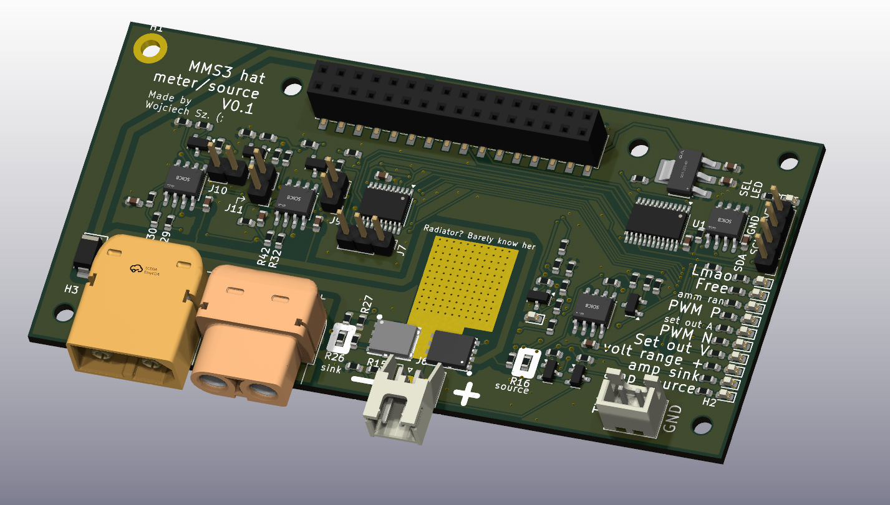

# MMS3 Hat Meter Source

## Sekcja 1: Dokumentacja Hat'a

### Krótki opis projektu
Hat meter-source to hat z woltomierzem, amperemoierzem, źródłem prądowym, napięciowym, obciążeniem napięciowym, prądowym (i pewnie też mocowym) na 1 kanale. Aktualnie płytka ma na celu przetestowanie konceptu i jest prototypem

### Zgodność ze standardem ChainBus

* ✅ Używa złącza ChainBus, nie zmienia jego miejsca ani pinoutu.
* ✅ Używa wyłącznie interfejsów I2C, SPI lub UART i nie inicjuje samodzielnie nowych transmisji (Nie jest master'em I2C albo SPI).
* ✅ Spełnia wymagania mechaniczne standardu (wymiary PCB, rozstaw otworów).
* ✅ Pobiera maksymalny prąd zgodny z ilością na jednego hat'a **-> Ma złącze XT60**
* ❌ Obsługuje napięcie wejściowe BRD_VIN do wartości 48V. **-> 12V max**

### Komunikacja i adresowanie

#### Magistrala Chainbus  I2C
Poniższa tabela przedstawia adresację urządzeń na magistrali I2C.

| Układ (IC)   | Funkcja                 |     Address     |
| :----------- | :---------------------- | :-------------: |
| **CH32V003** | Główny kontroler płytki | `Programowalny` |

#### Magistrala Chainbus SPI
Brak

#### Magistrala Chainbus UART
Brak

### Pinout złączy

| Jn     | Co                              | Jaki pin co robi                        |
| :----- | :------------------------------ | :-------------------------------------- |
| **J6** | Wyjście/wejście miernika/źródła | Pin 1: +  Pin 2: -                   |
| **J8** | TX UART z CH32V003              | Pin 1: TX (nazwany: free)  Pin 2: 0V |

Okay, i będe nazywał Pin + z J6 jako "Obciążenie" albo "Źródło" albo "Wejście" w dalszej części dokumentacji. To jest ten główny element tej płytki

### Wzmacniaczne operacyjne
Na płytce są użyte 4 wzmacniacze operacyjne

#### OpAmp Amperomierzy Wzmocniania Główny (OpAmp Amperomierzy)
Na schemacie to U3 kanał 1

| Pin  | Do czego podłączony                   |
| :--- | :------------------------------------ |
| +    | Wybrany bocznik prądowy (Sink/Source) |
| -    | Programowalny Rezystor Feedback       |
| OUT  | Amm_ADC (CH32 PD3)                    |

Programowalne wzmocnienie k

k = 31, jeśli Amm_Range_1 == 0

k = 70, jeśli Amm_Range_1 == 1

#### OpAmp Wzmocnienia amperomierza dla Mosfetów (OpAmp AmmMos)
Na schemacie to U6 kanał 1

| Pin  | Do czego podłączony                       |
| :--- | :---------------------------------------- |
| +    | Wybrany bocznik prądowy (Sink/Source)     |
| -    | Stały Rezystor Feedback                   |
| OUT  | Mosfet_Feedback jeśli Sel_Output_amm == 1 |

Stałe wzmocnienie = 11

Note: Wybrany bocznik prądowy jest ten sam dla obu OpAmp'ów. Nie możesz mieć jednego na jednym i drugiego na drugim

Note: Oba boczniki prądowe mają 20mΩ

#### OpAmp Mosfeta N
Na schemacie to U3 kanał 2

| Pin  | Do czego podłączony |
| :--- | :------------------ |
| +    | PWM_N z filtrem RC  |
| -    | Mosfet_Feedback     |
| OUT  | Bramka NMos'a       |

#### OpAmp Mosfeta P
Na schemacie to U7 kanał 2

| Pin  | Do czego podłączony |
| :--- | :------------------ |
| +    | Mosfet_Feedback     |
| -    | PWM_P z filtrem RC  |
| OUT  | Bramka PMos'a       |

Mosfet'y P są logicznie odwrócone od N, dlatego  mają na odwrót podłączenia + -

### Pinout CH32
| Pin            | Net name z kicad'a   | Co robi                                                                                      |
| :------------- | :------------------- | :------------------------------------------------------------------------------------------- |
| **PC0**        | PWM_P                | Sygnał PWM do wejścia OpAmp'a PMos'a                                                         |
| **PC1 (SDA)**  | N/A                  | SDA do ChainBus'a                                                                            |
| **PC2 (SCL)**  | N/A                  | SCL do ChainBus'a                                                                            |
| **PC3**        | Sel_Output_amm       | Wybór sprzężenia zwrotnego OpAmp'a PMos i Nmos - Na wyjście OpAmp'a AmmMos                   |
| **PC4**        | Sel_Output_Volt      | Wybór sprzężenia zwrotnego OpAmp'a PMos i Nmos - Na dzielnik napięcia 0.2 * Napięcie wejścia |
| **PC5 (SCK)**  | Amm_Range_1          | Wybór programowalnego wzmocnianie OpAmp'a Amperomierzy                                       |
| **PC6 (MOSI)** | Sel_Amp_Source       | Wybór wejscia dla OpAmp AmmMos i Amperomierzy na prąd wchodzący do pinu '+' Wejścia (Source) |
| **PC7 (MISO)** | Sel_Amp_Sink         | Wybór wejscia dla OpAmp AmmMos i Amperomierzy na prąd wychodzący z pinu '+' Wejścia (Sink)   |
| **PD0**        | Volt_Range1          | Wybór programowalnego dzielnika napięcia dla Volt_ADC                                        |
| **PD1**        | N/A                  | SWIO, programowanie MCU                                                                      |
| **PD2**        | PWM_N                | Sygnał PWM do wejścia OpAmp'a NMos'a                                                         |
| **PD3**        | Amm_ADC              | Kanał ADC połączony z wyjściem OpAmp'a Amperomierzy                                          |
| **PD4**        | Volt_ADC             | Kanał ADC połączony z programowalnym dzielnikiem napięcie Wejścia                            |
| **PD5 (TX)**   | Free                 | Wolny pin, do użycia jako dioda debug lub TX UART'a CH32V003                                 |
| **PD6 (RX)**   | Lmao1                | Wybór sprzężenia zwrotnego OpAmp'a - Na stałe 1.65V                                          |
| **PD7 (NRST)** | *NC (niepodłączony)* | NC                                                                                           |

Note: żeby Sel_Output_Volt, Sel_Output_amm i lmao1 działały potrzeba zewrzeć odpowiednio zworki J9 J10 J11

Note: Zwieraj je jedna na raz, bo jak kilka zewrzesz na Mosfet_Feedback będzie takie jak na najwyższym napięciu z podłączonych zworek

### Konfiguracja układu (Zworki/Rezystory)

| Co      | Jak podłączone                    | Efekt                                                                                             |
| :------ | :-------------------------------- | :------------------------------------------------------------------------------------------------ |
| **R15** | R15 Wylutowane   R15 Wlutowane | J6 '-' niepodłączony   J6 '-' podłączony do GND                                                |
| **R16** | R16 Wylutowane   R16 Wlutowane | Bramka Pmos'a podłączona do VIN_ChainBus   Bramka Pmos'a podłączona do wyjścia swojego OpAmp'a |
| **R26** | R26 Wylutowane   R26 Wlutowane | Bramka Nmos'a podłączona do 0V   Bramka Nmos'a podłączona do wyjścia swojego OpAmp'a           |
| **R27** | R27 Wylutowane   R27 Wlutowane | Dolna część mostka H odłączona   Dolna część mostka H podłączona do GND                        |
| **R29** | R29 Wylutowane   R29 Wlutowane | Wejście '-' OpAmp'a NMos'a floating   Wejście '-' OpAmp'a NMos'a podłączone do Mosfet_Feedback |
| **R30** | R30 Wylutowane   R30 Wlutowane | Wejście '+' OpAmp'a NMos'a floating   Wejście '+' OpAmp'a NMos'a podłączone do PWM_N przez RC  |
| **R32** | R32 Wylutowane   R32 Wlutowane | Wejście '-' OpAmp'a PMos'a floating   Wejście '-' OpAmp'a PMos'a podłączone do PWM_P przez RC  |
| **R42** | R42 Wylutowane   R42 Wlutowane | Wejście '+' OpAmp'a PMos'a floating   Wejście '+' OpAmp'a PMos'a podłączone do Mosfet_Feedback |
| **J9**  | J9 Rozwarte   J9 Zwarte        | Sel_Output_Volt nie działa jest elektrycznie odłączone   Można używać Sel_Output_Volt          |
| **J10** | J10 Rozwarte   J10 Zwarte      | Sel_Output_amm nie działa jest elektrycznie odłączone   Można używać Sel_Output_amm            |
| **J11** | J11 Rozwarte   J11 Zwarte      | Lmao1 nie działa jest elektrycznie odłączone   Można używać Lmao1                              |

Bascially rezystorów nie trzeba ruszać, chyba że chcesz wyłączyć któraś połowe mostka H, a zworki chcesz mieć tylko jedną na raz podpiętą jak zaczynasz programować.

### Szczegółowy opis
Na Hat'ie jest
- 1 Kanał woltomierza o programowalnym dzielniku napięcia
- 1 Kanał amperomierza o programowalnym wzmocnieniu oraz wybieralnym wejściu (między mierzeniem prądu sink a source)
- 1 Półmostek H

Do złącza J6 można podłączyć obciążenie/źródło i mierzyć prąd/napięcie na nim lub zasilać/obciążać go programowalnie. Minus (pin 1) tego złacza jest zwarty do masy układu, a plus (pin 2) jest podłączony do półmostka H.

Można mierzyć napięcie na **Wejściu** (J6 Pin 2). Napięcie **Wejścia** jest podłączone przez programowalny dzielnik napięciea do kanału ADC CH32V003 (Volt_ADC, PD4). Programowalny dzielnik napięcie zmienia się przez konfiguracje Volt_Range1

| Stan Volt_Range1 | napięcie na Volt_ADC        |
| :--------------- | :-------------------------- |
| High             | 0.2 * Napięcie Wejściowe    |
| Low              | 0.4285 * Napięcie Wejściowe |

Można mierzyć prąd na **Wejściu**. W tym celu na początku należy wybrać który prąd chcemy mierzyć
- Sel_Amp_Source - Prąd który płynie od '-' wyjścia do GND (Do amperomierza, i programowalnego źródła)
- Sel_Amp_Sink - Prąd który płynie od +, przez Mostek H do GND (Do Programable load)

Tryb pomiaru prądu (Sink, Source) jest wybrany dla pomiaru prądu przez mikrokontroler oraz dla OpAmp AmmMos (Sprzęrzenia zwrotnego OpAmp'ów Mosfetów). Pomiar prądu odbywa się przez rezystory 20mΩ. Napięcie na tym rezystorze jest wzmocnione. OpAmp AmmMos ma stałe wzmocnienie = 11 a mikrokontroler programowalne przez Amm_Range_1.

| Stan Amm_Range_1 | napięcie na Amm_ADC |
| :--------------- | :------------------ |
| High             | 71 * Prąd * 0.02    |
| Low              | 31 * Prąd * 0.02    |

Sterowanie półmostkiem H odbywa się pośrednio przez PWM z mikrokontrolera. Pośrednio, bo PWM jest wygładzane filtrem RC i idzie do wzmacniacza operacyjnego. Tak to wygląda:

PWM z MCU (PWM_N albo PWM_H) -> Filtr dolnoprzepustowty RC który z PWM robi stałe napięcie = 3.3 * % PWM -> Feedback Op Amp'a

Wzmacniacz operacyjny porównuje to wygładzone PWM z jedną z kilku programowo wybieranych opcji (Sel_Output_Volt, Sel_Output_amm, Lmao1) W celu zaimplementowanie closed loop control

| Co ma HIGH      | Do czego podpięty jest Mosfet_Feedback | Co można zaimplementować              |
| :-------------- | :------------------------------------- | ------------------------------------- |
| Sel_Output_Volt | 0.2 *          Napięcie Wejściowe      | Constant voltage source/sink          |
| Sel_Output_amm  | 11 * Prąd * 0.02                       | Constant current source/sink          |
| Lmao1           | 1.65V                                  | Sam amperomierz/woltomierz. Debugging |

Filtr RC składa się z 1kΩ i 1uF

Wszystkie Piny CH32V003 zostały wyprowadzone na Led'y w celu ułatwienia debuggowania. Oby to nie sprawiło problemów bo przez to są weak pulldown

### Tryby pracy
Jeśli jesteś programistą, to spoko gdyby udało ci się coś takiego zaimplementować

- Mierzenie napięcia
- Mierzenie prądu
- Źródło Prądowe
- Źródło Napięciowe
- Programowalne obciążenie Prądowe
- Programowalne obciążenie Napięciowe
- Programowalne obciążenie Mocowe

Która z tych opcji jest wybrana, wartości zmierzone albo nastawy muszą być konfigurowalne z poziomu MMS3, a nie Hat'a. I fajnie gdyby był jeden program na CH32 na wszystkie te tryby (One soft to rule them all ;)

I trzeba napisać oba: Software na CH32V003 i biblioteke hat'a żeby to działało ze sobą. Jak masz problem z CH32 to możesz debuggować WCH-Link'iem albo prinf'em (TX -> UART/USB przejściówka -> PC)

### Gotowe arkusze hierarchiczne
W projekcie zaprojektowano/użyto następujących arkuszy hierarchicznych:
* CH32V003

---

## Sekcja 2: Specyfikacja standardu ChainBus

### Architektura i łączenie modułów
Standard ChainBus umożliwia modułowe łączenie hatów. Na jednym MMS3 można zamontować pionowo **do 8 hat'ów**. Połączenie realizowane jest poprzez wpięcie złącza męskiego kolejnego hat'a w złącze żeńskie poprzedniego

### Komunikacja i sterowanie
Magistrala ChainBus jest w pełni cyfrowa. Płyta główna nie steruje bezpośrednio sygnałami ogólnego przeznaczenia (GPIO) na poszczególnych hat'ach. Wszelkie operacje (np. obsługa diod LED, odczyt krańcówek, generowanie sygnałów PWM) muszą być realizowane przez dedykowane układy scalone (np. ekspandery portów, sterowniki) komunikujące się przez interfejsy systemowe.

*Przykład:*
`MCU` $\rightarrow$ `Expander GPIO po I2C` $\rightarrow$ `Dioda LED`

Wybór aktywnego modułu realizowany jest przez układ przełącznika magistrali (bus switch) na płycie głównej. Dzięki temu linie I2C, SPI i UART są niezależne dla każdego hat'a (brak konfliktów adresów I2C między różnymi hatami).
* **Identyfikacja:** Każdy moduł powinien posiadać pamięć EEPROM na magistrali I2C w celu identyfikacji płyty przez system - układ M24C64-W skonfigurowany na adres `0x50` przy liniach adresowych A0, A1, A2 zwartych do masy.

### Zasilanie
Złącze ChainBus dostarcza następujące linie zasilania:

| Magistrala zasilania | Napięcie znamionowe | Maksymalny prąd (łączny dla 8 hatów) | Szacowany prąd na jeden hat |
| :------------------- | :-----------------: | :----------------------------------: | :-------------------------: |
| **5V**               |        5.0 V        |                1.0 A                 |           125 mA            |
| **12V stby**         |       12.0 V        |                0.5 A                 |            65 mA            |
| **BRD_VIN**          |   12.0 V – 48.0 V   |                1.5 A                 |           185 mA            |

*   Komponenty podłączone do linii `BRD_VIN` muszą być przystosowane do pracy z napięciem od 12V do **48 V**.
*   W przypadku zapotrzebowania na wyższą moc, dopuszczalne jest zastosowanie dodatkowego złącza zasilania XT60 (obciążalność do ok. 60 A).

### Wymagania mechaniczne i złącza
* **Wymiary PCB:** Niedozwolona jest zmiana obrysu płytki oraz położenia otworów montażowych, aby zachować kompatybilność mechaniczną.
* **Pozycjonowanie złączy ChainBus:** Położenie złącza standardu 2x16 SMD (raster 2.54 mm) musi być zgodne z szablonem. Złącze żeńskie montowane jest na stronie FRONT, natomiast złącze męskie na stronie BACK.
* **Interfejsy zewnętrzne:** Złącza wejścia/wyjścia (domyślnie standard JST-XH 2.5 mm o obciążalności do 3 A) oraz opcjonalne złącze XT60 powinny być umieszczone przy dolnej krawędzi płytki. Elementy regulacyjne i sygnalizacyjne (potencjometry, przełączniki, diody LED) należy lokalizować przy prawej krawędzi płytki.
* **Komponenty** Wszystkie komponenty powinny być na stronie front płytki żeby nie haczyły o elementy ze wcześniejszego hat'a

---

## Sekcja 3: Licencje

### Licencje projektu

*   **PCB:** CERN-OHL-P
*   **Software:** MIT License

[Template](https://github.com/KoNaR-Hefajstos/MMS3_hat_templates/) jest na licencji CC0 1.0 Universal. **Reszta projektu nie jest na tej licencji**
